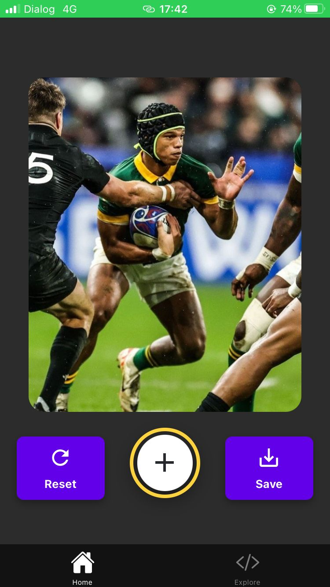
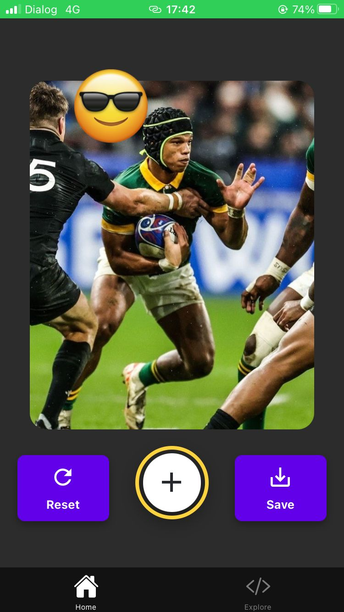
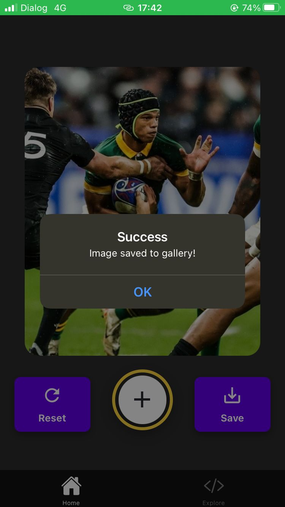

---

# Sticker Smash - Expo App 👋

This project is an Expo-based mobile application created as part of the **Sticker Smash** project. Below are the steps and instructions to set up, develop, and run the app.

## Get started

1. **Install dependencies**:

   ```bash
   npm install
   ```

2. **Start the app**:

   ```bash
   npx expo start
   ```

   In the output, you'll find options to open the app in a:

   - [Development build](https://docs.expo.dev/develop/development-builds/introduction/)
   - [Android emulator](https://docs.expo.dev/workflow/android-studio-emulator/)
   - [iOS simulator](https://docs.expo.dev/workflow/ios-simulator/)
   - [Expo Go](https://expo.dev/go), a limited sandbox for trying out app development with Expo

## Current Setup

1. **Java Development Kit (JDK)**:
   - Installed `jdk-17` for Android development.

2. **Gradle Setup**:
   - Configured `gradle-8.8-all.zip` in the `gradle-wrapper.properties`.

3. **Android Emulator**:
   - Attempted to run the app on an Android emulator but encountered issues with the Gradle setup. Resolved by ensuring the correct Gradle version and deleting the `.gradle` cache.

4. **USB Debugging**:
   - Plan to run the app on an Android device via USB. Make sure USB debugging is enabled on the device, and run:
     ```bash
     npx expo run:android
     ```
     This will build and deploy the app to the connected Android device.

## Running the App on Android Device via USB

1. **Enable USB Debugging**:
   - On your Android device, enable USB debugging in the Developer Options.

2. **Run the App**:
   - Connect your device to your computer via USB.
   - In the terminal, navigate to your project directory and run:
     ```bash
     npx expo run:android
     ```
   - This will build the app and run it on the connected device.

## Common Issues & Resolutions

1. **Gradle Issues**:
   - If you encounter issues with Gradle, try clearing the Gradle cache:
     ```bash
     rm -rf ~/.gradle
     ```
   - On Windows, you can delete the `.gradle` folder in `C:\Users\<YourUsername>\.gradle`.

2. **Metro Bundler Not Starting**:
   - Ensure Metro Bundler is running. If not, start it manually:
     ```bash
     npx react-native start
     ```

3. **Failed to Load Script**:
   - Ensure the Metro server is running and your project is properly connected.

## Reset the Project

When you're ready for a fresh start, run:

```bash
npm run reset-project
```

This command will move the starter code to the **app-example** directory and create a blank **app** directory where you can start developing.

## Screenshots

## Screenshots

Below are some screenshots of the **Sticker Smash** app:

<table>
  <tr>
    <td></td>
    <td></td>
  </tr>
  <tr>
    <td></td>
    <td></td>
  </tr>
</table>


## Learn More

To learn more about developing your project with Expo, explore the following resources:

- [Expo documentation](https://docs.expo.dev/): Learn fundamentals, or go into advanced topics with our [guides](https://docs.expo.dev/guides).
- [Learn Expo tutorial](https://docs.expo.dev/tutorial/introduction/): Follow a step-by-step tutorial where you'll create a project that runs on Android, iOS, and the web.

## Join the Community

Join our community of developers creating universal apps.

- [Expo on GitHub](https://github.com/expo/expo): View our open source platform and contribute.
- [Discord community](https://chat.expo.dev): Chat with Expo users and ask questions.

---